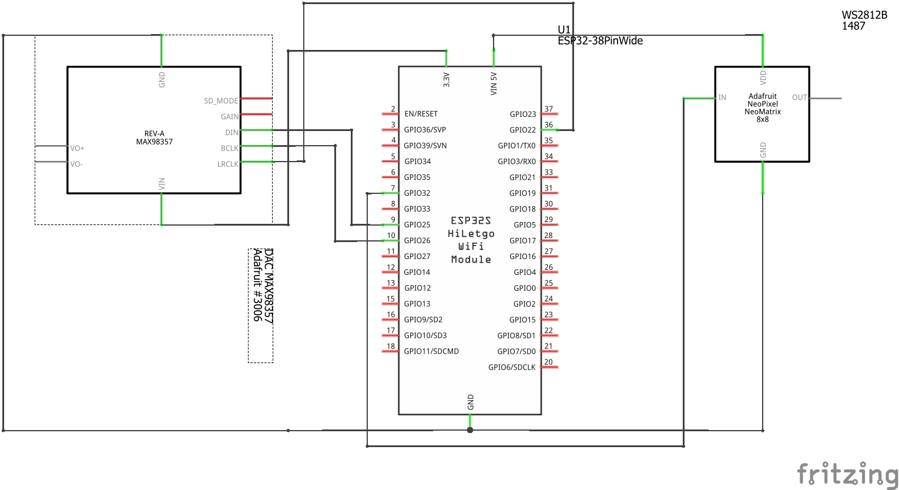
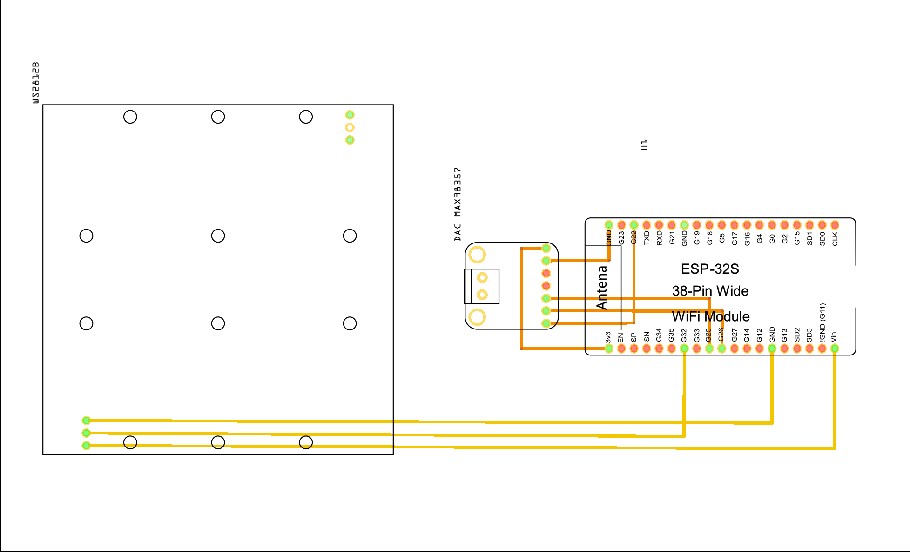

# *Proyecto Final. Altavoz bluetooth con matriz led*
## **Introducción**
En este proyecto mostraré como he realizado un altavoz bluetooth con una matriz led interactiva con un Microprocesador ESP32. Mostraré como establecer la conexión necesaria para que el procesador sea un dispositivo de audio, y la matriz de leds interactúe con el sonido.
## **Hardware**
* ESP32-Wroom-32.
* DAC de audio MAX98357 (I2S).
* Altavoz pasivo de 3 Watts y 4 omhs.
* Matriz de LED WS2812B-64 (8x8).
## **Montaje y esquemas del circuito**
Cada una de las fases del proyecto y por las que ha pasado las tienen en 4 videos diferentes colgados en el GitHub, a posteriori aquí les voy a mostrar el esquema teórico de conexiones y como se planteó la soldadura de los componentes.



## **Software y su funcionamiento**
### **- Cabecera del código**
Al princio del proyecto se realizan los includes de las librerias necesarias, en nuestro caso realizamos 5 includes de los cuales 4 son librerias y 1 es un headerfile. 

Incluimos la libreria "Arduino" debido a que estamos programando en entorno Arduino, como tambien la libreria "ArduinoFFT" para implementar calculos de transformada de Fourier de punto flotante. Y ya a nivel periferico introducimos la libreria "Fastled" para el uso de la Matriz de leds y la "BluetoothA2DPSink" para establecer las funciones bluetooth.

A continuacion, definimos los pines para el DAC de audio, el numero de leds, su pin y el canal, y por ultimo los ajustes para el ArduinoFFT. Y creamos 3 objetos para iniciar las tres librerias.
```cpp
#include <Arduino.h>
#include <FastLED.h>
#include "icons.h"
#include <BluetoothA2DPSink.h>
#include <ArduinoFFT.h>
/* ------------------------------------------------------------- */
// Ajustes de Audio
#define I2S_DOUT    25
#define I2S_BCLK    26
#define I2S_LRC     22
#define MODE_PIN    33

// Ajustes LED
#define LED_COUNT   64
#define LED_PIN     32
#define CHANNEL     0

#define DATA_PIN 32

// Ajustes FFT
#define NUM_BANDS 8
#define SAMPLES 512
#define SAMPLING_FREQUENCY 44100

#define BRIGHTNESS 50
/* ------------------------------------------------------------- */
CRGB leds[LED_COUNT];
BluetoothA2DPSink a2dp_sink;
arduinoFFT FFT = arduinoFFT();
/* ------------------------------------------------------------- */
```
### **- Iniciación de variables**
En este paso iniciaremos diferentes parametros para el control del sonido y necesarios para las funciones FFT para realizar la interacion de los leds con el audio.

Iniciamos una variable de tipo "int" con valor fijo de 39. Posteriormente, creamos un controlador de queue con la funcion "QueueHandle_t", y dos variables int de 16 bits, para guardar el sample left & right.

Una vez hechos los parametros para el audio, creamos los necesarios para la imagen. Comenzamos con una variable de tipo "float" para la amplitud ya iniciada a 200, a continuacion un int de 32 bits al que iniciamos en todo ceros. Dos double's para la parte real e imaginaria de la transformada de fourier, y un otro double para el brillo que se inicia en 0.25. Para finalizar haremos un int para contabilizar en numero de visualizaciones iniciado a 0, y dos int's uno de 32 bits para la ultima actualizacion visual, y otro para el Offset.
```cpp
/* ------------------------------------------------------------- */
int pushButton = 39;

QueueHandle_t queue;
int16_t sample_l_int;
int16_t sample_r_int;
/* ------------------------------------------------------------- */
float amplitude = 200.0;
int32_t peak[] = {0, 0, 0, 0, 0, 0, 0, 0};
double vReal[SAMPLES];
double vImag[SAMPLES];

double brightness = 0.25;

int visualizationCounter = 0;
int32_t lastVisualizationUpdate = 0;
uint8_t hueOffset = 0;
/* ------------------------------------------------------------- */
```
### **- Configuración de sonido**
La configuración del audio la iniciaremos con dos constantes estáticas, una para los pines y una base para el audio. En la configuración de los pines estableceremos la conexión de cada una de las funciones con los pines ya definidos. En la configuración del Bluetooth estableceremos el modo, la velocidad, los bits, el formato del canal de salida y el tipo de comunicación, etc.

Posteriormente, estableceremos una variable booleana para establecer si el dispositivo está reproduciendo audio, y un objeto que lo indique. También, crearemos otra variable booleana para indicar si el dispositivo está conectado.
```cpp
/* ------------------------------------------------------------- */
// Audio Configuration
 static const i2s_pin_config_t i2s_pin_config =
  {
    .bck_io_num = I2S_BCLK, //Conexion BCLK
    .ws_io_num = I2S_LRC, //Conexion LRC
    .data_out_num = I2S_DOUT, //Conexion DIN
    .data_in_num = I2S_PIN_NO_CHANGE
  };

  static const i2s_config_t i2s_config =
  {
    .mode = (i2s_mode_t)(I2S_MODE_MASTER | I2S_MODE_TX),
    .sample_rate = 44100, //velocidad del bluetooth
    .bits_per_sample = (i2s_bits_per_sample_t)16,
    .channel_format = I2S_CHANNEL_FMT_RIGHT_LEFT,
    .communication_format = I2S_COMM_FORMAT_I2S_MSB,
    .intr_alloc_flags = 0, //default interrupt priority
    .dma_buf_count = 8,
    .dma_buf_len = 64,
    .use_apll = false,
    .tx_desc_auto_clear = true
  };
/* ------------------------------------------------------------- */
// Audio State Management
bool devicePlayedAudio = false;
esp_a2d_audio_state_t currentAudioState = ESP_A2D_AUDIO_STATE_REMOTE_SUSPEND;

// device connection management
bool bleDeviceConnected = false;
/* ------------------------------------------------------------- */
```
### **- Índice de la Matriz led**
La siguiente función convierte las coordenadas x/y en el rango {0..7}/{0..7} como se muestra a continuación en un índice LED en el rango {0..63}.
```cpp
/* ------------------------------------------------------------- */
// Index de la Matriz Led
uint8_t getLedIndex(uint8_t x, uint8_t y) {
  if (x % 2 == 1) {
    return 63 - (y + x * 8);
  } else {
    return 63 - (7 - y + x * 8);
  }
}
/* ------------------------------------------------------------- */
```
### **- Bandas de Audio**
En el siguiente "void" crearemos las bandas de audio para la pantalla interactiva con el sonido, de forma en la que separaremos en diferentes frecuencias la matriz de leds.
```cpp
/* ------------------------------------------------------------- */
void createBands(int i, int dsize) 
{
  uint8_t band = 0;
  if (i <= 2) {
    band = 0; // 125Hz
  } else if (i <= 5) {
    band = 1; // 250Hz
  } else if (i <= 7) {
    band = 2; // 500Hz
  } else if (i <= 15) {
    band = 3; // 1000Hz
  } else if (i <= 30) {
    band = 4; // 2000Hz
  } else if (i <= 53) {
    band = 5; // 4000Hz
  } else if (i <= 106) {
    band = 6; // 8000Hz
  } else {
    band = 7;
  }
  int dmax = amplitude;
  if (dsize > dmax)
    dsize = dmax;
  if (dsize > peak[band]) {
    peak[band] = dsize;
  }
}
/* ------------------------------------------------------------- */
```
### **- Render del FFT**
En este módulo realizaremos los cálculos necesarios con la función de "ArduinoFFT" para realizar la pantalla interactiva con el audio.
```cpp
/* ------------------------------------------------------------- */
void renderFFT(void *parameter) {
  int item = 0;
  for (;;) {
    if (uxQueueMessagesWaiting(queue) > 0) {

      FFT.Windowing(vReal, SAMPLES, FFT_WIN_TYP_HAMMING, FFT_FORWARD);
      FFT.Compute(vReal, vImag, SAMPLES, FFT_FORWARD);
      FFT.ComplexToMagnitude(vReal, vImag, SAMPLES);

      for (uint8_t band = 0; band < NUM_BANDS; band++) {
        peak[band] = 0;
      }

      // Don't use sample 0 and only first SAMPLES/2 are usable. Each array eleement represents a frequency and its value the amplitude.
      for (int i = 2; i < (SAMPLES / 2); i++) {
        if (vReal[i] > 2000) { // Add a crude noise filter, 10 x amplitude or more
          createBands(i, (int)vReal[i] / amplitude);
        }
      }

      // Release handle
      xQueueReceive(queue, &item, 0);

      uint8_t intensity;

      FastLED.clear();
      FastLED.setBrightness(BRIGHTNESS);
      for (byte band = 0; band < NUM_BANDS; band++) {
        intensity = map(peak[band], 1, amplitude, 0, 8);

        for (int i = 0; i < 8; i++) {
          leds[getLedIndex(7 - i, 7 - band)] = (i >= intensity) ? CHSV(0, 0, 0) : CHSV(i * 16, 255, 255);
        }
      }

      FastLED.show();

      if ((millis() - lastVisualizationUpdate) > 1000) {
        log_e("Fps: %f", visualizationCounter / ((millis() - lastVisualizationUpdate) / 1000.0));
        visualizationCounter = 0;
        lastVisualizationUpdate = millis();
        hueOffset += 5;
      }
      visualizationCounter++;
    }
  }
}
/* ------------------------------------------------------------- */
```
### **- Módulo de iconos**
En este módulo se calcula y establece el brillo de los leds, y posteriormente mediante un iterador "for" para establecer cada led del dibujo.
```cpp
/* ------------------------------------------------------------- */
void drawIcon (const uint32_t *icon)
{
  uint8_t brightness = (exp(sin(millis() / 2000.0 * PI)) - 0.36787944) * 42.54590641;
  FastLED.setBrightness(brightness);
  for (int i = 0; i < LED_COUNT; i++) {
    uint32_t pixel = pgm_read_dword(icon + i);
    uint8_t red = (pixel >> 16) & 0xFF;
    uint8_t green = (pixel >> 8) & 0xFF;
    uint8_t blue = pixel & 0xFF;
    log_v("%d. %08X, %02X %02X %02X", i, pixel, red, green, blue);
    leds[getLedIndex(i % 8, i / 8)] = CRGB(green, red, blue);
  }
  delay(1);
  FastLED.show();
}
/* ------------------------------------------------------------- */
```
### **- Módulo de datos de aduio**
En este módulo solamente prepara las muestras de audio que recibe del bluetooth, solo si la cola está vacía. Una vez comprobado que no hay ningún dato en la cola, se agregan datos con un iterador "for", separando los datos introducidos a través de un parámetro int de 16 bits, en muestras del lado izquierdo y derecho. Al finalizar el bucle for, se envía al proceso incorporado en el core 1 la información para que pueda empezar.
```cpp
/* ------------------------------------------------------------- */
void audio_data_callback(const uint8_t *data, uint32_t len)
{
  int item = 0;
  // Only prepare new samples if the queue is empty
  if (uxQueueMessagesWaiting(queue) == 0)
  {
    // log_e("Queue is empty, adding new item");
    int byteOffset = 0;
    for (int i = 0; i < SAMPLES; i++) 
    {
      sample_l_int = (int16_t)(((*(data + byteOffset + 1) << 8) | *(data + byteOffset)));
      sample_r_int = (int16_t)(((*(data + byteOffset + 3) << 8) | *(data + byteOffset + 2)));
      vReal[i] = (sample_l_int + sample_r_int) / 2.0f;
      vImag[i] = 0;
      byteOffset = byteOffset + 4;
    }

    // Tell the task in core 1 that the processing can start
    xQueueSend(queue, &item, portMAX_DELAY);
  }
}
/* ------------------------------------------------------------- */
```
### **- Módulo de conexion Bluetooth**
Este módulo consta simplemente de un if y un else, debido a que solo se utiliza para darle un nuevo valor a la variable previamente asignada como "bleDeviceConnected". Comprobamos el estado del dispositivo con la siguiente función "ESP_A2D_CONNECTION_STATE_CONNECTED" si es igual al valor de "state" variaremos asignaremos a la variable booleana un valor de true, en caso contrario le asignaremos el valor de false.
```cpp
/* ------------------------------------------------------------- */
void connection_state_changed(esp_a2d_connection_state_t state, void *)
{
  //log_i("Connection state changed, new state: %d", state);
  if (ESP_A2D_CONNECTION_STATE_CONNECTED == state)
  {
    bleDeviceConnected = true;
  }
  else
  {
    bleDeviceConnected = false;
  }
}
/* ------------------------------------------------------------- */
```
### **- Estructura del Setup**
En el Setup iniciamos estableciendo la velocidad de comunicación del dispositivo en, 115200 ms, y realizamos la configuración del pushButton, continuamos definiendo los leds y sus parámetros. Después, asignamos a la cola "queue" los valores antes generados, haremos una comprobación de que no este vacía, si la cola esta llena generamos una "Task" asignada a uno de los cores para que efectúe el módulo de RenderFFT. Para finalizar, aplicaremos las configuraciones de los pines y de audio al objeto de bluetooth, lo iniciamos con un nombre, y redirigimos el sonido que se emite al módulo "audio_data_callback" y el cambio de conexión al módulo "connection_state_changed".
```cpp
/* ------------------------------------------------------------- */
void setup() 
{
  Serial.begin(115200);
  pinMode(MODE_PIN, OUTPUT);
  pinMode(pushButton, INPUT);
  digitalWrite(MODE_PIN, HIGH);

  FastLED.addLeds<WS2812B, DATA_PIN>(leds, LED_COUNT);
  /* ------------------------------------------------------------- */
  queue = xQueueCreate(1, sizeof(int));
  if (queue == NULL)
  {
    log_i("Error creating the A2DP->FFT queue");
  }

  // This task will process the data acquired by the Bluetooth audio stream
  xTaskCreatePinnedToCore(renderFFT,      // Function that should be called
                          "FFT Renderer", // Name of the task (for debugging)
                          10000,          // Stack size (bytes)
                          NULL,           // Parameter to pass
                          1,              // Task priority
                          NULL,           // Task handle
                          1               // Core you want to run the task on (0 or 1)
  );
  /* ------------------------------------------------------------- */
  a2dp_sink.set_pin_config(i2s_pin_config);
  a2dp_sink.set_i2s_config(i2s_config);
  a2dp_sink.start("Rafa_BT");
  // redirecting audio data to do FFT
  a2dp_sink.set_stream_reader(audio_data_callback);
  a2dp_sink.set_on_connection_state_changed(connection_state_changed);
}
/* ------------------------------------------------------------- */
```
### **- Estructura del Loop**
En la estructura del Loop comenzaremos asignando a la variable de State el valor que no nos proporciona el objeto "a2dp_sink", después comprobaremos si el estado habitual que está asignado a false es distinto al de la variable State, en ese caso se le asignará a CurrentAudioState el valor de State. Después de realizar este cambio, tenemos tres casos en una estructura Switch, que servirán para efectuar los cambios en los visuales de la matriz de leds.
```cpp
/* ------------------------------------------------------------- */
void loop() 
{
  esp_a2d_audio_state_t state = a2dp_sink.get_audio_state();
  if (currentAudioState != state)
  {
    //log_i("Audio state changed; new state: %d", state);
    currentAudioState = state;
  }
  switch (state)
  {
  // Unclear how stopped and remote suspend really differ from one another. In
  // ESP32-A2DP >= v1.6 we seem to be getting the later when the client stops
  // audio playback.
  case ESP_A2D_AUDIO_STATE_REMOTE_SUSPEND:
  case ESP_A2D_AUDIO_STATE_STOPPED:
    if (bleDeviceConnected)
    {
      if (devicePlayedAudio)
      {
        drawIcon(PAUSE);
      }
      else
      {
        drawIcon(BLE);
      }
    }
    else
    {
      drawIcon(HEART);
    }
    break;
  case ESP_A2D_AUDIO_STATE_STARTED:
    devicePlayedAudio = true;
    break;
  }
}
```
## **Código completo**
```cpp
#include <Arduino.h>
#include <FastLED.h>
#include "icons.h"
#include <BluetoothA2DPSink.h>
#include <ArduinoFFT.h>
/* ------------------------------------------------------------- */
// Ajustes de Audio
#define I2S_DOUT    25
#define I2S_BCLK    26
#define I2S_LRC     22
#define MODE_PIN    33

// Ajustes LED
#define LED_COUNT   64
#define LED_PIN     32
#define CHANNEL     0

#define DATA_PIN 32

// Ajustes FFT
#define NUM_BANDS 8
#define SAMPLES 512
#define SAMPLING_FREQUENCY 44100

#define BRIGHTNESS 50
/* ------------------------------------------------------------- */
CRGB leds[LED_COUNT];
BluetoothA2DPSink a2dp_sink;
arduinoFFT FFT = arduinoFFT();
/* ------------------------------------------------------------- */
int pushButton = 39;

QueueHandle_t queue;
int16_t sample_l_int;
int16_t sample_r_int;
/* ------------------------------------------------------------- */
float amplitude = 200.0;
int32_t peak[] = {0, 0, 0, 0, 0, 0, 0, 0};
double vReal[SAMPLES];
double vImag[SAMPLES];

double brightness = 0.25;

int visualizationCounter = 0;
int32_t lastVisualizationUpdate = 0;
uint8_t hueOffset = 0;
/* ------------------------------------------------------------- */
// Configuración de sonido
 static const i2s_pin_config_t i2s_pin_config =
  {
    .bck_io_num = I2S_BCLK, //Conexion BCLK
    .ws_io_num = I2S_LRC, //Conexion LRC
    .data_out_num = I2S_DOUT, //Conexion DIN
    .data_in_num = I2S_PIN_NO_CHANGE
  };

  static const i2s_config_t i2s_config =
  {
    .mode = (i2s_mode_t)(I2S_MODE_MASTER | I2S_MODE_TX),
    .sample_rate = 44100, //velocidad del bluetooth
    .bits_per_sample = (i2s_bits_per_sample_t)16,
    .channel_format = I2S_CHANNEL_FMT_RIGHT_LEFT,
    .communication_format = I2S_COMM_FORMAT_I2S_MSB,
    .intr_alloc_flags = 0, //default interrupt priority
    .dma_buf_count = 8,
    .dma_buf_len = 64,
    .use_apll = false,
    .tx_desc_auto_clear = true
  };
/* ------------------------------------------------------------- */
// Audio State Management
bool devicePlayedAudio = false;
esp_a2d_audio_state_t currentAudioState = ESP_A2D_AUDIO_STATE_REMOTE_SUSPEND;

// device connection management
bool bleDeviceConnected = false;
/* ------------------------------------------------------------- */
// Index de la Matriz Led
uint8_t getLedIndex(uint8_t x, uint8_t y)
{
  if (x % 2 == 1) {
    return 63 - (y + x * 8);
  } else {
    return 63 - (7 - y + x * 8);
  }
}
/* ------------------------------------------------------------- */
void createBands(int i, int dsize) 
{
  uint8_t band = 0;
  if (i <= 2) {
    band = 0; // 125Hz
  } else if (i <= 5) {
    band = 1; // 250Hz
  } else if (i <= 7) {
    band = 2; // 500Hz
  } else if (i <= 15) {
    band = 3; // 1000Hz
  } else if (i <= 30) {
    band = 4; // 2000Hz
  } else if (i <= 53) {
    band = 5; // 4000Hz
  } else if (i <= 106) {
    band = 6; // 8000Hz
  } else {
    band = 7;
  }
  int dmax = amplitude;
  if (dsize > dmax)
    dsize = dmax;
  if (dsize > peak[band])
  {
    peak[band] = dsize;
  }
}
/* ------------------------------------------------------------- */
void renderFFT(void *parameter)
{
  int item = 0;
  for (;;)
  {
    if (uxQueueMessagesWaiting(queue) > 0)
    {
      FFT.Windowing(vReal, SAMPLES, FFT_WIN_TYP_HAMMING, FFT_FORWARD);
      FFT.Compute(vReal, vImag, SAMPLES, FFT_FORWARD);
      FFT.ComplexToMagnitude(vReal, vImag, SAMPLES);

      for (uint8_t band = 0; band < NUM_BANDS; band++)
      {
        peak[band] = 0;
      }

      // Don't use sample 0 and only first SAMPLES/2 are usable. Each array eleement represents a frequency and its value the amplitude.
      for (int i = 2; i < (SAMPLES / 2); i++)
      {
        if (vReal[i] > 2000) // Add a crude noise filter, 10 x amplitude or more
        {
          createBands(i, (int)vReal[i] / amplitude);
        }
      }

      // Release handle
      xQueueReceive(queue, &item, 0);

      uint8_t intensity;

      FastLED.clear();
      FastLED.setBrightness(BRIGHTNESS);
      for (byte band = 0; band < NUM_BANDS; band++)
      {
        intensity = map(peak[band], 1, amplitude, 0, 8);

        for (int i = 0; i < 8; i++)
        {
          leds[getLedIndex(7 - i, 7 - band)] = (i >= intensity) ? CHSV(0, 0, 0) : CHSV(i * 16, 255, 255);
        }
      }

      FastLED.show();

      if ((millis() - lastVisualizationUpdate) > 1000)
      {
        log_e("Fps: %f", visualizationCounter / ((millis() - lastVisualizationUpdate) / 1000.0));
        visualizationCounter = 0;
        lastVisualizationUpdate = millis();
        hueOffset += 5;
      }
      visualizationCounter++;
    }
  }
}
/* ------------------------------------------------------------- */
void drawIcon (const uint32_t *icon)
{
  uint8_t brightness = (exp(sin(millis() / 2000.0 * PI)) - 0.36787944) * 42.54590641;
  FastLED.setBrightness(brightness);
  for (int i = 0; i < LED_COUNT; i++)
  {
    uint32_t pixel = pgm_read_dword(icon + i);
    uint8_t red = (pixel >> 16) & 0xFF;
    uint8_t green = (pixel >> 8) & 0xFF;
    uint8_t blue = pixel & 0xFF;
    log_v("%d. %08X, %02X %02X %02X", i, pixel, red, green, blue);
    leds[getLedIndex(i % 8, i / 8)] = CRGB(green, red, blue);
  }
  delay(1);
  FastLED.show();
}
/* ------------------------------------------------------------- */
void audio_data_callback(const uint8_t *data, uint32_t len)
{
  int item = 0;
  // Only prepare new samples if the queue is empty
  if (uxQueueMessagesWaiting(queue) == 0)
  {
    // log_e("Queue is empty, adding new item");
    int byteOffset = 0;
    for (int i = 0; i < SAMPLES; i++) 
    {
      sample_l_int = (int16_t)(((*(data + byteOffset + 1) << 8) | *(data + byteOffset)));
      sample_r_int = (int16_t)(((*(data + byteOffset + 3) << 8) | *(data + byteOffset + 2)));
      vReal[i] = (sample_l_int + sample_r_int) / 2.0f;
      vImag[i] = 0;
      byteOffset = byteOffset + 4;
    }

    // Tell the task in core 1 that the processing can start
    xQueueSend(queue, &item, portMAX_DELAY);
  }
}
/* ------------------------------------------------------------- */
void connection_state_changed(esp_a2d_connection_state_t state, void *)
{
  //log_i("Connection state changed, new state: %d", state);
  if (ESP_A2D_CONNECTION_STATE_CONNECTED == state)
  {
    bleDeviceConnected = true;
  }
  else
  {
    bleDeviceConnected = false;
  }
}
/* ------------------------------------------------------------- */
void setup() 
{
  Serial.begin(115200);
  pinMode(MODE_PIN, OUTPUT);
  pinMode(pushButton, INPUT);
  digitalWrite(MODE_PIN, HIGH);

  FastLED.addLeds<WS2812B, DATA_PIN>(leds, LED_COUNT);
  /* ------------------------------------------------------------- */
  queue = xQueueCreate(1, sizeof(int));
  if (queue == NULL)
  {
    log_i("Error creating the A2DP->FFT queue");
  }

  // This task will process the data acquired by the Bluetooth audio stream
  xTaskCreatePinnedToCore(renderFFT,      // Function that should be called
                          "FFT Renderer", // Name of the task (for debugging)
                          10000,          // Stack size (bytes)
                          NULL,           // Parameter to pass
                          1,              // Task priority
                          NULL,           // Task handle
                          1               // Core you want to run the task on (0 or 1)
  );
  /* ------------------------------------------------------------- */
  a2dp_sink.set_pin_config(i2s_pin_config);
  a2dp_sink.set_i2s_config(i2s_config);
  a2dp_sink.start("Rafa_BT");
  // redirecting audio data to do FFT
  a2dp_sink.set_stream_reader(audio_data_callback);
  a2dp_sink.set_on_connection_state_changed(connection_state_changed);
}
/* ------------------------------------------------------------- */
void loop() 
{
  esp_a2d_audio_state_t state = a2dp_sink.get_audio_state();
  if (currentAudioState != state)
  {
    //log_i("Audio state changed; new state: %d", state);
    currentAudioState = state;
  }
  switch (state)
  {
  // Unclear how stopped and remote suspend really differ from one another. In
  // ESP32-A2DP >= v1.6 we seem to be getting the later when the client stops
  // audio playback.
  case ESP_A2D_AUDIO_STATE_REMOTE_SUSPEND:
  case ESP_A2D_AUDIO_STATE_STOPPED:
    if (bleDeviceConnected)
    {
      if (devicePlayedAudio)
      {
        drawIcon(PAUSE);
      }
      else
      {
        drawIcon(BLE);
      }
    }
    else
    {
      drawIcon(HEART);
    }
    break;
  case ESP_A2D_AUDIO_STATE_STARTED:
    devicePlayedAudio = true;
    break;
  }
}
```