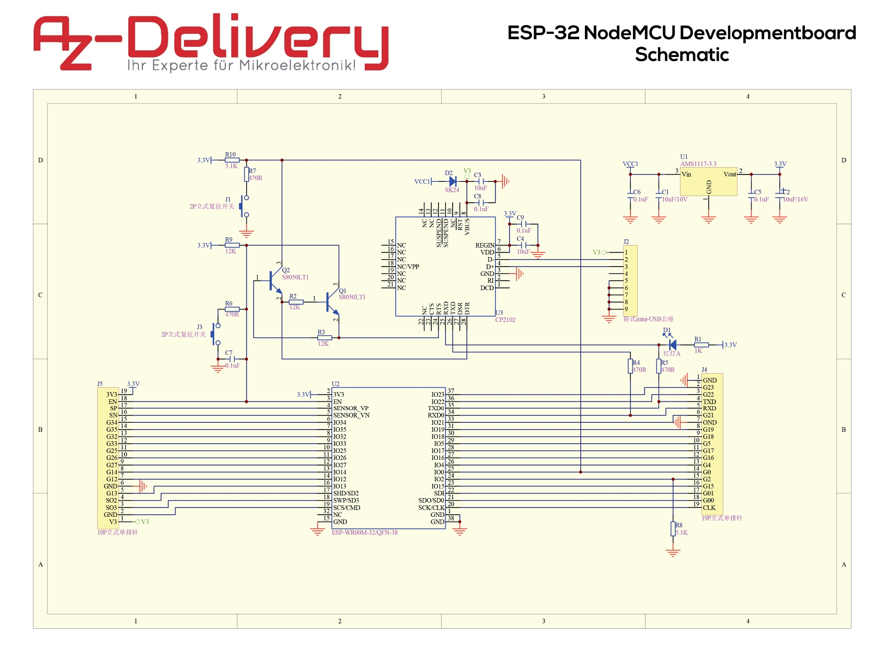
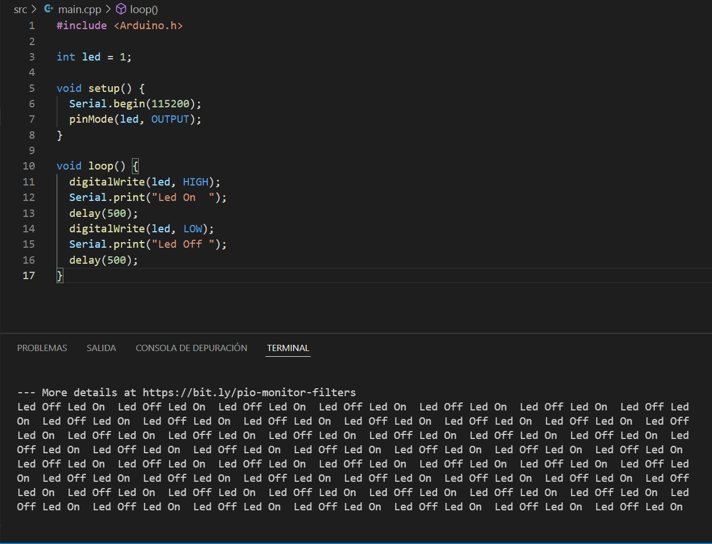
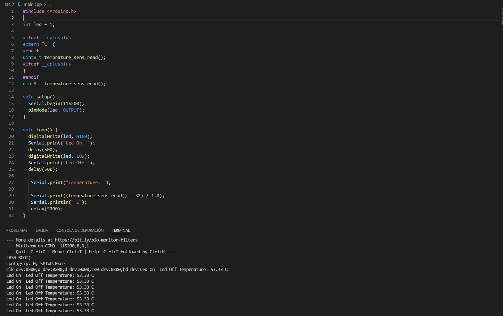

# Practica 1: Blink

## **Objetivo**
Generar un programa que mediante un bucle infinto encienda y apage un led durante 500 milisegundos cada fase, y respectivamente escriba por el puerto serie un mensaje de ON y OFF.

## **Funcionamiento**
En primer lugar iniciaremos el platformio, su entorno de trabajo y el modelo de la placa. En nuestro caso el modelo de placa que utilizo es el espressif32-nodemcu-32s, y el framework sera Ardiuno.

A continuacion utilizaremos el codigo de ejemplo que nos proporciona el entorno Arduino, desde su aplicacion. Lo unico que tendremos que hacer es definir el led ya que no es el mismo a una placa Arduino. Para hacer uso del propio led incorporado de la placa podemos ver el esquema electronico de la placa, para el uso de un led externo se puede seleccionar cualquier PIN que se identifique como "GPIO". Visualizando el esquema podemos observar que el led incorporado se encuentra en el pin "GPIO1" (hay que tener en cuenta que el pin del led incorporado es el mismo que el de comunicaciones, por lo cual visualmente pueden haber interferencias.)

Por ultimo se complia el programa y se carga en la ESP32 mediante la extension de PlatfromIO.

## **Codigo**

## **Diagrama de flugo**

## **Diagrama de tiempo**

## **Ejercicio Voluntario**
Para la parte voluntaria leeremos el valor del sensor de temperatura interno y mostraremos el valor por el puerto serie. Realizaremos la medicion en conjunto con la funcion de Blink.

 ### **El codigo**
 
