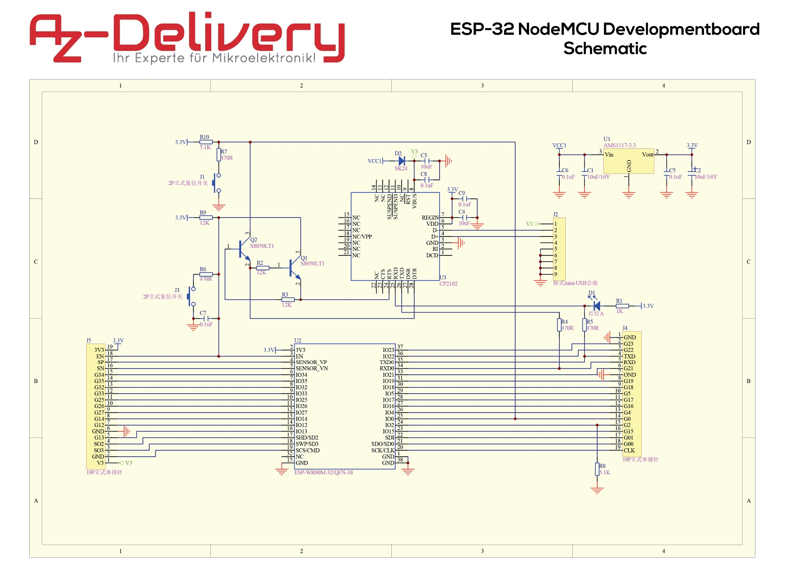
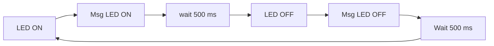

# Practica 1.1. Blink

## **Introducción**
Generar un programa que mediante un bucle infinito encienda y apague un led durante 500 milisegundos cada fase, y respectivamente escriba por el puerto serie un mensaje de ON y OFF.

## **Funcionamiento**
En primer lugar, iniciaremos el PlatformIO, su entorno de trabajo y el modelo de la placa. En nuestro caso el modelo de placa que utilizo es el espressif32-nodemcu-32s, y el framework será Arduino.

A continuación utilizaremos el código de ejemplo que nos proporciona el entorno Arduino, desde su aplicación. Lo único que tendremos que hacer es definir el led, ya que no es el mismo a una placa Arduino. Para hacer uso del propio led incorporado de la placa podemos ver el esquema electrónico de la placa, para el uso de un led externo se puede seleccionar cualquier PIN que se identifique como "GPIO". Visualizando el esquema podemos observar que el led incorporado se encuentra en el pin "GPIO1" (hay que tener en cuenta que el pin del led incorporado es el mismo que el de comunicaciones, por lo cual visualmente puede haber interferencias.)



Por último se compila el programa y se carga en la ESP32 mediante la extensión de PlatformIO.
## **Código completo**
```cpp
#include <Arduino.h>

int led = 1;

void setup()
{
    serial.begin(115200);
    pinMode(led, OUTPUT);
}

void loop()
{
    digitalWrite(led,HIGH);
    Serial.print("Led On ");
    delay(500);
    digitalWrite(led,LOW);
    Serial.print("Led Off ")
    delay(500);
}
```
## **Diagrama de flujo**

## **Diagrama de tiempo**

## **Ejercicio Voluntario**
Para la parte voluntaria leeremos el valor del sensor de temperatura interno y mostraremos el valor por el puerto serie. Realizaremos la medición en conjunto con la función de Blink.

 ### **Código completo**
```cpp
#include <Arduino.h>

int led = 1;

#ifdef __cplusplus
extern "C" {
#endif
uint8_t temprature_sens_read();
#ifdef __cplusplus
}
#endif
uint8_t temprature_sens_read();

void setup() { 
  Serial.begin(115200);
  pinMode(led, OUTPUT);
}

void loop() {
  digitalWrite(led, HIGH);
  Serial.print("Led On  ");
  delay(500);
  digitalWrite(led, LOW);
  Serial.print("Led Off ");
  delay(500);

   Serial.print("Temperature: ");

   Serial.print((temprature_sens_read() - 32) / 1.8);
   Serial.println(" C");
   delay(5000);
}
```
