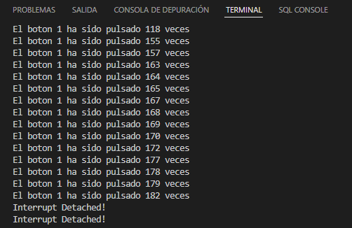

# Practica 2.1. Interrupciones por GPIO
## **Introducción**
En el ESP32, podemos definir una función de rutina de servicio de interrupción que se llamara cuando un pin GPIO cambie el valor de su señal.

Con una placa ESP32, todos los pines GPIO pueden ser configurados para funcionar como entradas de solicitud de interrupción.
## **Hardware**
* ESP32-Wroom-32D.
* Pulsador ( o tambien se puede realizar con dos cables ).
* ProtoBoard
## **Software y su funcionamiento**
### **- Adjuntar la interrupción a un PIN GPIO**
En el IDE de Arduino, usamos una función llamada attachInterrupt() para establecer una interrupción con base en un pin por pin. La sintaxis que se recomienda es la siguiente:
```cpp
attachInterrupt(GPIOPin, ISR, Mode);
```
### **- Desconectar la interrupción de un GPIO**
La función de separación de interrupciones cuando ya no quieras que el proceso monitorice un pin se realiza con la siguiente sintaxis:
```cpp
detachInterrupt(GPIOPin);
```
### **- Estructura del pulsador**
En esta parte se define una estructura para el pulsador que contiene una variable bool que mantiene el valor de sí está accionado o no el pulsador, también, una variable para guardar el número de veces que se ha accionado el pulsador. Y se define un constructor por defecto que será el pin 18 con la variable contable a 0 y sin pulsar.
```cpp
struct Button 
{
  const uint8_t PIN;
  uint32_t numberKeyPresses;
  bool pressed;
};

Button button1 = {18, 0, false};
```
### **- Rutina de servicio de interrupción**
Esta es la función que se llama cuando ocurre el evento de la interrupción, desde de ser corta de ejecución. Su sintaxis es la siguiente:
```cpp
void IRAM_ATTR isr() 
{
  button1.numberKeyPresses += 1;
  button1.pressed = true;
}
```
Esta acción ira contando las veces que se acciona el pulsador y que servirá para ver si ha sido accionado o no.
### **- Estructura del Setup**
Se inicializan los pines de como entrada y con la función AttachInterrupt se hará la interrupción.
```cpp
void setup()
{  
  Serial.begin(115200);
  pinMode(button1.PIN, INPUT_PULLUP);
  attachInterrupt(button1.PIN, isr, FALLING);
}
```
### **- Estructura del Loop**
En esta parte de la estructura se indica que cada vez que se pulsa se muestre el GPIO que ha sido pulsado y el número de veces que ha sido pulsado.
Posteriormente, se establece que cada cierto intervalo de tiempo se interrumpa el programa.
```cpp
void loop()
{
  if (button1.pressed) 
{
  Serial.printf("El boton 1 ha sido pulsado %u veces\n", button1.numberKeyPresses);
  button1.pressed = false;
}

static uint32_t lastMillis = 0;

if (millis() - lastMillis > 50000) 
{
  lastMillis = millis();
  detachInterrupt(button1.PIN);
  Serial.println("Interrupt Detached!");
}
}
```
### **- Funcionamiento**
Debido a la falta de un circuito para estabilizar la señal y evitar rebotes o falsos contactos, el número de veces que se contabiliza como que el pulsador ha sido accionado es desorbitado.



## **Código completo**
```cpp
struct Button 
{
const uint8_t PIN;
uint32_t numberKeyPresses;
bool pressed;
};

Button button1 = {18, 0, false};

void IRAM_ATTR isr() 
{
button1.numberKeyPresses += 1;
button1.pressed = true;
}
void setup() 
{
Serial.begin(115200);
pinMode(button1.PIN, INPUT_PULLUP);
attachInterrupt(button1.PIN, isr, FALLING);
}

void loop() 
{
  if (button1.pressed) {
  Serial.printf("El boton 1 ha sido pulsado %u veces\n", button1.numberKeyPresses);
  button1.pressed = false;
}

static uint32_t lastMillis = 0;

if (millis() - lastMillis > 50000) {
  lastMillis = millis();
  detachInterrupt(button1.PIN);
  Serial.println("Interrupt Detached!");
}
}
```