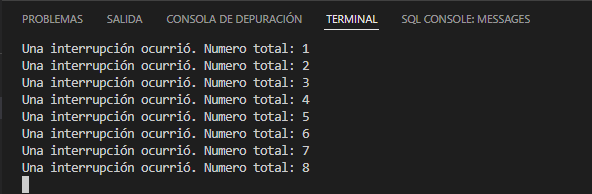

# Practica 2.2. Interrupciones por Timer
## **Introducción**
Un temporizador es un contador interno, que al terminar un determinado número de cuentas produce una interrupción.
## **Software y su funcionamiento**
### **- Contador de interrupciones**
Con el uso de la funcion "volatile" se trata de evitar que el proceso elimine el contenido de la variable que guardara el número de interrupciones causadas por el proceso.

Se define otra variable que guardara el total de interrupciones, la cual no requiere del uso "volatile". También, se definirá un puntero que servirá para configurar el timer. Y una última variable que servirá para sincronizar el "void loop" y la ISR.
```cpp
volatile int interruptCounter;
int totalInterruptCounter;

hw_timer_t * timer = NULL;
portMUX_TYPE timerMux = portMUX_INITIALIZER_UNLOCKED;
```
### **- Rutina de servicio de interrupción**
Esta función servirá para contar el número de interrupciones que se producirá cada vez que el "void loop" tenga una interrupción, todo esto ocurrir dentro de una sección crítica definida con la sintaxis siguiente:
```cpp
void IRAM_ATTR onTimer() 
{
  portENTER_CRITICAL_ISR(&timerMux);
  interruptCounter++;
  portEXIT_CRITICAL_ISR(&timerMux);
}
```
### **- Estructura del Setup**
La estructura del Setup que realizaremos teniendo en cuenta que la ESP32 trabaja en una frecuencia base de señal de 80 MHz, se define que el "timerAlarmWrite" en microsegundos, de ahí, el valor de 1000000. El valor booleano "true" del timer indica que el contador contara de forma progresiva.

Con la función "timerAttachInterrupt" servirá para utilizar la interrupción. El parámetro será la variable de tiempo global, "&onTimer" que trata de una ubicación de la función anteriormente mencionada, el parámetro "true" indica que la interrupción será de tipo "edge".

En la función "TimerAlarmWrite" servirá para especificar el valor del contador en el que se generara la interrupción del temporizador. El parámetro "true" indicara que el contador se recargara, por lo tanto, la interrupción se generara de forma periódica. También, el "TimerAlarmEnable" servirá para habilitar el temporizador.
```cpp
void setup() \
{
  Serial.begin(115200);
  timer = timerBegin(0, 80, true);
  timerAttachInterrupt(timer, &onTimer, true);
  timerAlarmWrite(timer, 1000000, true);
  timerAlarmEnable(timer);
}
```
### **- Estructura del Loop**
En la estructura Loop, se realiza el manejo real de interrupciones, que consistirá simplemente en incrementar el contador con el número total de interrupciones que ocurrieron desde el comienzo del programa e imprimirlo en el puerto serie. 
```cpp
void loop() 
{
  if (interruptCounter > 0) 
  {
    portENTER_CRITICAL(&timerMux);
    interruptCounter--;
    portEXIT_CRITICAL(&timerMux);
    totalInterruptCounter++;
    Serial.print("Una interrupción ocurrió. Numero total: ");
    Serial.println(totalInterruptCounter);
  }
}
```
### **- Funcionamiento**

## **Código completo**
```cpp
volatile int interruptCounter;
int totalInterruptCounter;

hw_timer_t * timer = NULL;
portMUX_TYPE timerMux = portMUX_INITIALIZER_UNLOCKED;

void IRAM_ATTR onTimer() 
{
  portENTER_CRITICAL_ISR(&timerMux);
  interruptCounter++;
  portEXIT_CRITICAL_ISR(&timerMux);
}

void setup() 
{
  Serial.begin(115200);
  timer = timerBegin(0, 80, true);
  timerAttachInterrupt(timer, &onTimer, true);
  timerAlarmWrite(timer, 1000000, true);
  timerAlarmEnable(timer);
}

void loop() 
{
  if (interruptCounter > 0) 
  {
    portENTER_CRITICAL(&timerMux);
    interruptCounter--;
    portEXIT_CRITICAL(&timerMux);
    totalInterruptCounter++;
    Serial.print("Una interrupción ocurrió. Numero total: ");
    Serial.println(totalInterruptCounter);
  }
}
```