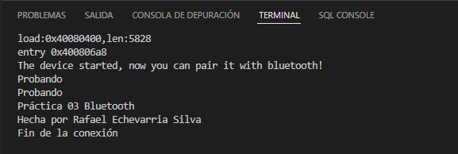
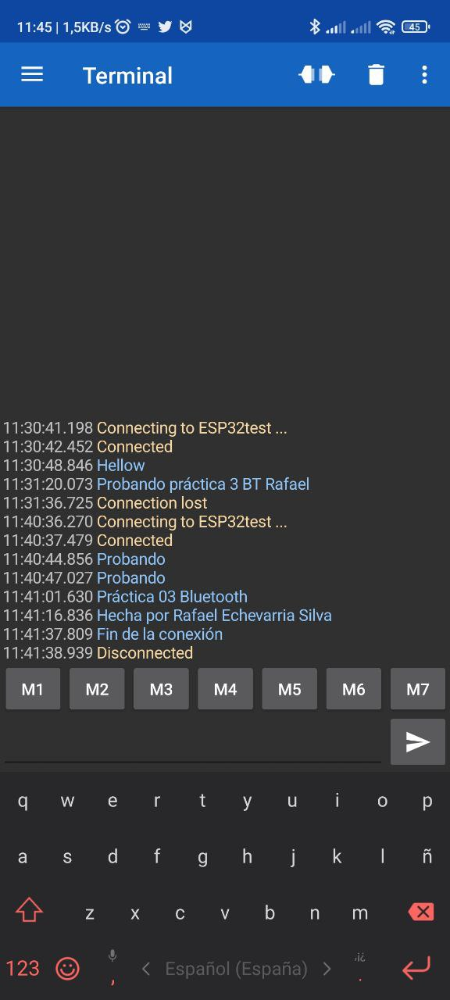

# Practica 3.2. Conexión Bluetooth
## **Introducción**
En esta práctica se realizará una comunicación bluetooth con el móvil y la ESP32, el cual necesitaremos una aplicación móvil para poder establecer una comunicación serie.
## **Hardware**
* ESP32-Wroom-32D.
* SmartPhone con conectividad Bluetooth.
* Apk Serial Bluetooth Terminal by Kai Morich.
## **Software y su funcionamiento**
### **- Cabecera del código**
Se incluyen las librerías necesarias para poder habilitar el bluetooth. Y se define una función "if" para verificar si el bluetooth está encendido si no sale un mensaje de error. Se atribuye como "SerialBT" y la sintaxis es la siguiente:
```cpp
#include <Arduino.h>
#include "BluetoothSerial.h"

#if !defined(CONFIG_BT_ENABLED) || !defined(CONFIG_BLUEDROID_ENABLED)
#error Bluetooth is not enabled! Please run `make menuconfig` to and enable it
#endif
BluetoothSerial SerialBT;
```
### **- Estructura del Setup**
Se establece la velocidad de comunicación del dispositivo, posteriormente, se establece en el "SerialBT" el nombre del dispositivo. Y finalmente se escribe por el monitor que el dispositivo está iniciado y que ya se puede establecer conexión.
```cpp
void setup() 
{
  Serial.begin(115200);
  SerialBT.begin("ESP32-Rafa"); //Bluetooth device name
  Serial.println("The device started, now you can pair it with bluetooth!");
}
```
### **- Estructura del Loop**
Se comprueba si está disponible el bluetooth, a continuación, lee la información y la escribe. Este proceso lo hace dos veces y finaliza con un delay de 20 ms para después repetirlo.
```cpp
void loop() 
{
  if (Serial.available()) {
    SerialBT.write(Serial.read());
  }
  if (SerialBT.available()) {
  Serial.write(SerialBT.read());
  }
delay(20);
}
```
### **- Funcionamiento**


## **Código completo**
```cpp
#include <Arduino.h>
#include "BluetoothSerial.h"

#if !defined(CONFIG_BT_ENABLED) || !defined(CONFIG_BLUEDROID_ENABLED)
#error Bluetooth is not enabled! Please run `make menuconfig` to and enable it
#endif

BluetoothSerial SerialBT;

void setup() 
{
  Serial.begin(115200);
  SerialBT.begin("ESP32-Rafa"); //Bluetooth device name
  Serial.println("The device started, now you can pair it with bluetooth!");
}

void loop() 
{
  if (Serial.available()) {
    SerialBT.write(Serial.read());
  }
  if (SerialBT.available()) {
  Serial.write(SerialBT.read());
  }
delay(20);
}
```
