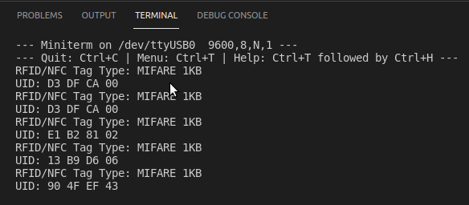

# Practica 6.1. Lectura de etiqueta RFID
## **Introducción**
En esta práctica usaremos un módulo RFID (Radio Frequency Identification), su principal funcionamiento consiste en pasar un TAG, cerca de un lector RFID, el TAG tiene la capacidad de enviar información al lector. El módulo se comunica por SPI, por lo que puede implementar con cualquier microcontrolador con interfaz SPI, como es nuestra ESP32.
## **Hardware**
* ESP32-Wroom-32.
* MFRC522 (Etiqueta RFID).
* Protoboard (opcional).
## **Software y su funcionamiento**
### **- Cabecera del código**
Al inicio del código iniciaremos con los "includes", como es habitual el de Arduino, y también incluiremos el necesario para hacer uso de las funciones SPI, "SPI.h", como también la librería necesaria para el periférico, "MFRC522.h".

Posteriormente, definiremos los pines, en el Pin Nª 9 es para el Reset del RC522 y el Pin Nª 10 es para la información SDA del módulo. Al final de la cabecera se define un objeto para el dispositivo, en el que incluiremos los dos pines anteriormente definidos.
```cpp
#include <Arduino.h>
#include <SPI.h>
#include <MFRC522.h>

#define RST_PIN 9 //Pin 9 para el reset del RC522
#define SS_PIN 10 //Pin 10 para el SS (SDA) del RC522

MFRC522 mfrc522(SS_PIN, RST_PIN); //Creamos el objeto para el RC522
```
### **- Estructura del Setup**
En el Setup iniciaremos declarando la velocidad de comunicación en 9600 ms, después, iniciamos el bus SPI con la función "SPI.begin();" e iniciamos el módulo RFID con "mfrc522.PCD_Init();". Para finalizar, enviamos un mensaje por pantalla que indique "Lectura del UID".
```cpp
void setup()
{
  Serial.begin(9600); //Iniciamos la comunicación serial
  SPI.begin(); //Iniciamos el Bus SPI
  mfrc522.PCD_Init(); // Iniciamos el MFRC522
  Serial.println("Tap an RFID/NFC tag on the RFID-RC522 reader");
}
```
### **- Estructura del Loop**
En la estructura del Loop, iniciamos con una función "if" para revisar si hay nuevas tarjetas presentes, en dicho caso, realizamos otra función "if" para seleccionar una tarjeta y con una iteración "for" enviamos de forma serial su UID. Y finalizamos la lectura de la tarjeta actual con la función "mfrc522.PICC_HaltA();".
```cpp
void loop()
{
// Revisamos si hay nuevas tarjetas presentes
  if ( mfrc522.PICC_IsNewCardPresent())
  {
//Seleccionamos una tarjeta
    if ( mfrc522.PICC_ReadCardSerial())
    {
      MFRC522::PICC_Type piccType = mfrc522.PICC_GetType(mfrc522.uid.sak);
      Serial.print("RFID/NFC Tag Type: ");
      Serial.println(mfrc522.PICC_GetTypeName(piccType));
    // Enviamos serialemente su UID
      Serial.print("UID:");
      for (byte i = 0; i < mfrc522.uid.size; i++)
      {
        Serial.print(mfrc522.uid.uidByte[i] < 0x10 ? " 0" : " ");
       Serial.print(mfrc522.uid.uidByte[i], HEX);    
      }
  Serial.println();
  // Terminamos la lectura de la tarjeta actual
  mfrc522.PICC_HaltA();
    }
  }
}
```
### **- Funcionamiento**

## **Código completo**
```cpp
#include <Arduino.h>
#include <SPI.h>
#include <MFRC522.h>

#define RST_PIN 9 //Pin 9 para el reset del RC522
#define SS_PIN 10 //Pin 10 para el SS (SDA) del RC522

MFRC522 mfrc522(SS_PIN, RST_PIN); //Creamos el objeto para el RC522

void setup()
{
  Serial.begin(9600); //Iniciamos la comunicación serial
  SPI.begin(); //Iniciamos el Bus SPI
  mfrc522.PCD_Init(); // Iniciamos el MFRC522
  Serial.println("Tap an RFID/NFC tag on the RFID-RC522 reader");
}

void loop()
{
// Revisamos si hay nuevas tarjetas presentes
  if ( mfrc522.PICC_IsNewCardPresent())
  {
//Seleccionamos una tarjeta
    if ( mfrc522.PICC_ReadCardSerial())
    {
      MFRC522::PICC_Type piccType = mfrc522.PICC_GetType(mfrc522.uid.sak);
      Serial.print("RFID/NFC Tag Type: ");
      Serial.println(mfrc522.PICC_GetTypeName(piccType));
    // Enviamos serialemente su UID
      Serial.print("UID:");
      for (byte i = 0; i < mfrc522.uid.size; i++)
      {
        Serial.print(mfrc522.uid.uidByte[i] < 0x10 ? " 0" : " ");
       Serial.print(mfrc522.uid.uidByte[i], HEX);    
      }
  Serial.println();
  // Terminamos la lectura de la tarjeta actual
  mfrc522.PICC_HaltA();
    }
  }
}
```