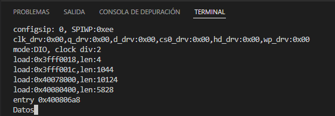

# Practica 8.1. Bucle de comunicacion UART2
## **Introducción**
En esta práctica realizaremos un bucle de comunicación de forma que los datos que se manden por el terminal rxd0 se redijiran a la uart2 txd2 (que debe estar conectado a rxd2) y la recepción de los datos de la uart2 se reenvíen de nuevo a la salida txd0 para que aparezcan en la pantalla del terminal.
## **Software y su funcionamiento**
### **- Cabecera del código**
En el inicio de esta práctica comenzaremos definiendo los pines que harán falta para realizar una comunicación UART2.
```cpp
#include <Arduino.h>

#define RXD0 34
#define TXD0 35
#define TXD2 28
```
### **- Estructura Setup**
En el void Setup, definiremos la velocidad de comunicación del chip a 115200. A continuación conectamos el puerto RXD0 con el TXD2, a través del "SERIAL_8N1". Y de igual forma lo hacemos con los puertos TXD2 hacia el TXD0.
```cpp
void setup()
{
  Serial.begin(115200);
  Serial1.begin(115200, SERIAL_8N1, RXD0, TXD2);
  Serial2.begin(115200, SERIAL_8N1, TXD2, TXD0);
}
```
### **- Estructura Loop**
Finalmente, en el void Loop realizamos dos if, en uno de ellos se leerá si el canal "Serial" está disponible, si lo está se escribirán sus datos en el "Serial1". En el otro if, se realizará prácticamente lo mismo, veremos si el "Serial1" está disponible, y si lo está, escribiremos sus datos en el "Serial2" y haremos un "printf("datos")" para ver los datos por el terminal.
```cpp
void loop()
{ 
  if(Serial.available())
    {
     Serial1.write(Serial.read());  
    }
   if(Serial1.available())
    {
     Serial2.write(Serial1.read());
     Serial.printf("Datos");  
    }
}
```
### **- Funcionamiento**

## **Código completo**
```cpp
#include <Arduino.h>

#define RXD0 34
#define TXD0 35
#define TXD2 28

void setup()
{
  Serial.begin(115200);
  Serial1.begin(115200, SERIAL_8N1, RXD0, TXD2);
  Serial2.begin(115200, SERIAL_8N1, TXD2, TXD0);
}

void loop()
{ 
  if(Serial.available())
    {
     Serial1.write(Serial.read());  
    }
   if(Serial1.available())
    {
     Serial2.write(Serial1.read());
     Serial.printf("Datos");  
    }
}
```