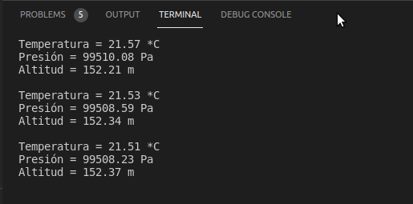

# Practica 5. I2C Sensor de altura, temperatura y presion
## **Introducción**
El objetivo de esta práctica es comprender el funcionamiento de los buses/sistemas de comunicación entre periféricos, estos elementos pueden ser internos o externos al procesador.
## **Hardware**
* ESP32-Wroom-32.
* Sensor I2C BMP280.
* Protoboard (opcional).
## **Software y su funcionamiento**
### **- Cabecera del Código**
Incluimos las librerías "Wire.h" también los "Adafruit_Sensor.h/_BMP280.h", a continuación, definiremos la variable "bmp" con la siguiente sintaxis:
```cpp
#include <Arduino.h>
#include <Wire.h>
#include <Adafruit_Sensor.h>
#include <Adafruit_BMP280.h>

Adafruit_BMP280 bmp;
```
### **- Estructura del Setup**
En la estructura del Setup principalmente estableceremos la velocidad de comunicación en 9600, posteriormente realizaremos un intento de comunicación con el periférico, si sale error nos mostrara por pantalla un mensaje de error de conexión. En el caso de realizar la conexión estableceremos el modo de operación, el muestreo de la temperatura, la presión y el filtrado, también, estableceremos el tiempo de descanso en 500 ms.
```cpp
void setup() 
{
  Serial.begin(9600);
  Serial.println(F("BMP280 test"));
  if (!bmp.begin()) 
  {
    Serial.println(F("Could not find a valid BMP280 sensor, check wiring!"));
    while (1);
  }
  bmp.setSampling(Adafruit_BMP280::MODE_NORMAL,     /* Modo de operación */
                  Adafruit_BMP280::SAMPLING_X2,     /* Temp. oversampling */
                  Adafruit_BMP280::SAMPLING_X16,    /* Presion oversampling */
                  Adafruit_BMP280::FILTER_X16,      /* Filtrado. */
                  Adafruit_BMP280::STANDBY_MS_500); /* Tiempo Standby. */
}
```
### **- Estructura del Loop**
En la estructura del Loop iremos recogiendo los valores en bruto (RAW) de temperatura, presión y altitud, para mostrarlos por pantalla. 
```cpp
void loop() 
{
    Serial.print(F("Temperatura = "));
    Serial.print(bmp.readTemperature());
    Serial.println(" *C");

    Serial.print(F("Presión = "));
    Serial.print(bmp.readPressure());
    Serial.println(" Pa");

    Serial.print(F("Altitud = "));
    Serial.print(bmp.readAltitude(1013.25));
    Serial.println(" m");

    Serial.println();
    delay(2000);
}
```
### **- Funcionamiento**

## **Código completo**
```cpp
#include <Arduino.h>
#include <Wire.h>
#include <Adafruit_Sensor.h>
#include <Adafruit_BMP280.h>

Adafruit_BMP280 bmp;

void setup() 
{
  Serial.begin(9600);
  Serial.println(F("BMP280 test"));
  if (!bmp.begin()) 
  {
    Serial.println(F("Could not find a valid BMP280 sensor, check wiring!"));
    while (1);
  }
  bmp.setSampling(Adafruit_BMP280::MODE_NORMAL,     /* Modo de operación */
                  Adafruit_BMP280::SAMPLING_X2,     /* Temp. oversampling */
                  Adafruit_BMP280::SAMPLING_X16,    /* Presion oversampling */
                  Adafruit_BMP280::FILTER_X16,      /* Filtrado. */
                  Adafruit_BMP280::STANDBY_MS_500); /* Tiempo Standby. */
}

void loop() 
{
    Serial.print(F("Temperatura = "));
    Serial.print(bmp.readTemperature());
    Serial.println(" *C");

    Serial.print(F("Presión = "));
    Serial.print(bmp.readPressure());
    Serial.println(" Pa");

    Serial.print(F("Altitud = "));
    Serial.print(bmp.readAltitude(1013.25));
    Serial.println(" m");

    Serial.println();
    delay(2000);
}
```